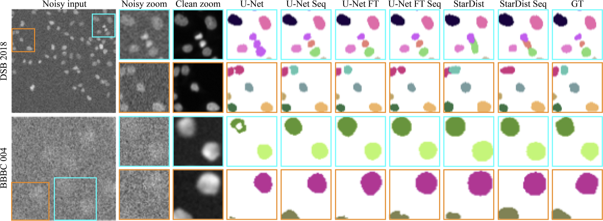

# VoidSeg: Leveraging Self-Supervised Denoising for Image Segmentation 
Mangal Prakash, Tim-Oliver Buccholz, Manan Lalit, Pavel Tomancak, Florian Jug<sup>1</sup>, Alexander Krull<sup>1</sup>

<sup>1</sup>Joint supervision


 
 
 

Deep learning (DL) has arguably emerged as the method of choice for the detection and segmentation of biological 
structures in microscopy images. However, DL typically needs copious amounts of annotated training data that is 
for biomedical projects typically not available and excessively expensive to generate. Additionally, tasks become 
harder in the presence of noise, requiring even more high-quality training data. Hence, we propose to use denoising 
networks to improve the performance of other DL-based image segmentation methods. More specifically, we present 
ideas on how state-of-the-art self-supervised CARE networks can improve cell/nuclei segmentation in microscopy data. 
Using two state-of-the-art baseline methods, U-Net and StarDist, we show that our ideas consistently improve the quality
of resulting segmentations, especially when only limited training data for noisy micrographs are available.

Paper: [https://arxiv.org/abs/1911.12239](https://arxiv.org/abs/1911.12239)

## Installation
This implementation requires [Tensorflow](https://www.tensorflow.org/install/).
We have tested VoidSeg on Linux Mint 18.1 Serena (Ubuntu 16.04), CUDA Version 9.0.176.4, 
NVIDIA-SMI Driver Version 396.26 using Python 3.6 and tensorflow-gpu 1.12.0. 

### From Scratch
We recommend using [miniconda](https://docs.conda.io/en/latest/miniconda.html).
If you do not yet have a strong opinion, just use it too!

After installing Miniconda, the following lines are likely the easiest way to get Tensorflow and CuDNN 
installed on your machine (_Note:_ Macs are not supported, and if you sit on a Windows machine all this might 
also require some modifications.):

```
$ conda create -n 'voidseg' python=3.6
$ source activate voidseg
$ conda install tensorflow-gpu=1.12 keras=2.2.4
$ pip install jupyter
```

Note: It is very important that the version of keras be 2.2.4 or 2.2.5, hence the explicit installation above.
Once this is done (or you had tensorflow et al. installed already), you can install VoidSeg with the following commands.

### Install from Sources 
This option is ideal if you want to edit the code. Clone the repository:

```
$ git clone https://github.com/juglab/VoidSeg.git
```
Change into its directory and install it:

```
$ cd VoidSeg
$ pip install -e .
```
You are now ready to run our notebooks.

## Datasets 
We use datasets from Data Science Bowl 2018 and Broad Bioimage Benchmark Collection. For more details on 
the datasets, please see the paper [http://arxiv.org/abs/1911.12239](http://arxiv.org/abs/1911.12239).

## Network Architectures
We show all our results for two different network architectures - 3 class U-Net (https://arxiv.org/pdf/1802.07465) 
and StarDist (https://arxiv.org/pdf/1806.03535).

## Getting Started
Have a look at our [jupyter notebooks](examples):

* [U-Net baseline (U-Net_Baseline.ipynb)
* U-Net Sequential (U-Net_Sequential.ipynb)
* U-Net finetune (U-Net_Finetune.ipynb)
* U-Net finetune sequential (U-Net_Finetune_Sequential.ipynb)
* StarDist baseline (StarDist_Baseline.ipynb)
* StarDist Sequential (StarDist_Sequential.ipynb)

## How to cite:
```
@article{prakash2019leveraging,
  title={Leveraging Self-supervised Denoising for Image Segmentation},
  author={Prakash, Mangal and Buchholz, Tim-Oliver and Lalit, Manan and Tomancak, Pavel and Jug, Florian and Krull, Alexander},
  journal={arXiv preprint arXiv:1911.12239},
  year={2019}
}
```

## Cluster Execution
Please note that this repository contains the jupyter notebooks version of VoidSeg 
[http://arxiv.org/abs/1911.12239](http://arxiv.org/abs/1911.12239). If 
you want to run many experiments at the same time, cluster scripts are preferable which can be found at 
[https://github.com/juglab/VoidSeg_cluster](https://github.com/juglab/VoidSeg_cluster). The cluster version is 
specifically adapted for MPI-CBG cluster. For your own cluster, please consider making appropriate changes.
